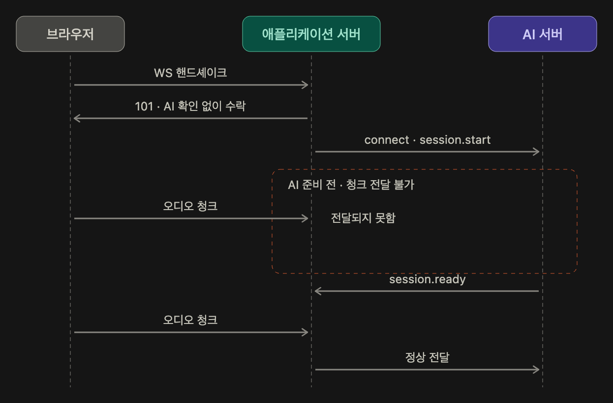
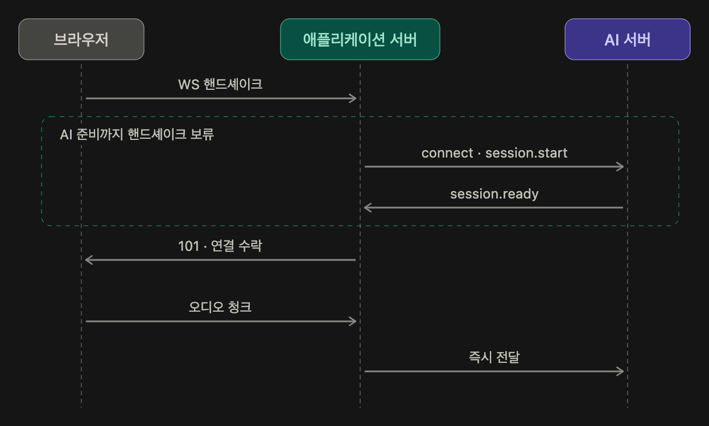

Meety 서비스(v1)에 대해 간략히 소개하자면, 팀 회의를 녹음해 실시간으로 전사하고 요약과 전사 발화자 분리를 제공합니다. 이 시리즈는 그 실시간 파이프라인을 만들어온 기록이며, 이번 1편에서는 개선기에 앞서, 처음에 어떤 구조로 설계했는지를 정리했습니다.

## 음성을 어떻게 처리하는가?

들어가기에 앞서 Meety는 음성이라는 데이터를 처리합니다. 일반적인 HTTP 요청에서 주고받는 텍스트나 JSON과는 조금 다른 특징을 가지고 있어서, 앞으로의 내용을 이해하는 데 필요한 정도만 간단하게 짚고 넘어가겠습니다.

사람의 음성은 연속적인 아날로그 신호입니다. 컴퓨터는 이를 그대로 처리할 수 없기 때문에 디지털 데이터로 바꿔줘야 하는데, 음성의 파형을 일정한 간격으로 측정해서 숫자로 표현하는 대표적인 방식이 PCM입니다.

다만 PCM은 압축되지 않은 오디오라 데이터 크기가 큽니다. 그래서 저장하거나 전송할 때는 Codec을 이용해 압축하는데, Meety에서는 Opus라는 오디오 Codec을 사용합니다.

- Codec : 오디오나 영상 데이터를 압축(Encoding)하고, 다시 사용할 수 있도록 복원(Decoding)하는 기술

이렇게 압축한 오디오와 해당 오디오를 해석하는 데 필요한 정보들을 일정한 형식으로 묶어놓은 것이 Container입니다. Meety에서는 브라우저의 `MediaRecorder`를 사용하고 있고, Opus로 인코딩된 오디오를 WebM Container에 담은 WebM/Opus 형식으로 음성을 다룹니다.

그렇다고 녹음이 끝날 때까지 기다렸다가 완성된 오디오를 한 번에 서버로 보내지는 않습니다. 그렇게 하면 회의가 끝나야 전사를 시작할 수 있는데, 사용자 입장에선 너무 오래 기다려야 합니다.

그래서 MediaRecorder는 지정한 시간 간격마다 녹음된 데이터를 Blob 형태로 제공할 수 있습니다. 현재 Meety는 20ms의 timeslice를 지정하고, 생성되는 오디오 데이터를 WebSocket을 통해 바로 서버로 전송합니다.

즉, 녹음 중인 오디오를 일정 단위로 계속 잘라서 보내는 구조이고, 앞으로는 이렇게 나눠서 전송하는 각각의 오디오 조각을 청크(Chunk)라고 부르겠습니다.

## 처음엔 전부 WebSocket이었습니다

기획 관점에서 Meety 서비스를 해석하면 현재 두 가지 실시간 흐름이 있었습니다.

1. 오디오 전송 → 녹음 시작자의 마이크 입력을 서버로의 지속적인 전송
2. 전사 받기 → 시스템(AI)이 만든 실시간 전사 텍스트를 회의에 참여한 모두에게 브로드캐스트

<iframe src="/embeds/realtime-two-flows.html" title="회의 중 두 가지 실시간 흐름" loading="lazy" style={{width:"100%",height:"480px",border:0,borderRadius:"8px"}}></iframe>

전자는 클라이언트가 서버로 계속 전송하는 흐름이고 후자는 서버가 여러 클라이언트로 전송만 하는 흐름이지만, 이 차이점을 처음부터 인지하고 있진 않았습니다.

처음 설계할 때 되게 단순하게 접근했습니다. 회의는 실시간이니까 참여자 모두 WebSocket을 연결하고, 녹음과 관련된 기능을 전부 그 위에서 처리하면 된다고 판단했습니다. 실시간이라는 요구사항을 WebSocket으로만 옮긴 것인데, 구현을 진행하면서 이 구조가 실제 사용 흐름과 맞지 않고, 또 불필요하다는 점을 깨달았습니다.

오디오 청크를 실시간으로 전송하는 사람은 참여자 전원이 아니라 녹음을 시작한 한 명뿐입니다. 나머지 참여자는 전사 결과를 받아서 보기만 하면 되는데, 모두가 양방향 WebSocket을 유지하는 점이 요구사항에 견주면 불필요하게 무거운 구조라고 판단했습니다.

왜 처음에 단순하게 WebSocket만 사용하려고 했는지 곰곰이 생각했습니다. 결국 원인은 데이터가 어느 방향으로 흐르는지를 따지지 않은 데 있었습니다. 실시간이라는 단어만 보고 WebSocket을 골랐을 뿐, 누가 무엇을 누구에게 보내는지는 구분하지 않았습니다.

## 후보 세 가지

다시 따지기 전에, 이전에 고민한 세 방식을 정리했습니다.

### HTTP

: 클라이언트가 요청을 보내고 서버가 응답을 내주는 프로토콜로, 각 요청은 stateless하며 HTTP/1.1의 Persistent Connection이나 HTTP/2 등을 통해 하위 연결을 재사용할 수 있습니다

#### 특징

- Request → Response
- 요청 시작 주체는 Client
- Text / Binary 전송 가능
- 일반적인 API에 적합
- Streaming Response도 가능

일반적인 API에는 HTTP가 적합하지만, 우리 서비스에는 오디오를 지속적으로 업로드하고 전사 결과를 실시간으로 전달해야 하는 요구사항이 있었기 때문에 단발성 Request-Response보다 지속적인 통신에 적합한 방식을 추가로 검토했습니다.

### SSE(Server-Sent Events)

: 하나의 HTTP 연결을 유지하면서 서버가 클라이언트에게 이벤트를 지속적으로 전달하는 방식입니다. 최초 연결은 클라이언트가 시작하지만, 연결 이후 서버가 지속적으로 데이터를 전송할 수 있습니다.

#### 특징

- Server → Client 단방향
- HTTP 기반
- Content-Type: text/event-stream
- 장시간 연결 유지
- EventSource 사용 시 자동 재연결
- id, Last-Event-ID를 활용한 이벤트 재전송 구조 설계 가능

전사 결과는 서버에서 회의 참여자에게 전달하기만 하면 됩니다. 클라이언트가 동일한 연결을 통해 서버로 데이터를 지속적으로 보낼 필요가 없기 때문에 양방향 WebSocket보다 서버의 단방향 전송에 적합한 SSE를 선택하게 됐습니다.

### WebSocket

: 하나의 연결을 장시간 유지하면서 클라이언트와 서버가 서로 독립적으로 데이터를 전송할 수 있는 전이중 통신 프로토콜입니다. 최초 연결 과정에서는 HTTP 기반 Handshake를 사용하고, 연결 이후에는 WebSocket Frame을 주고 받습니다.

#### 특징

- Client ↔ Server 양방향
- 전이중 통신 (양방향 + 동시전송)
- 장시간 연결 유지
- Text / Binary 지원
- HTTP Request/Response를 반복하지 않음
- 연결 이후 Message / Frame 단위 통신
- 자동 재연결은 기본 제공하지 않음
- 연결 상태 관리 필요

브라우저에서 생성되는 WebM/Opus 오디오 청크를 녹음하는 동안 서버로 지속적으로 전달해야 했습니다. 오디오는 Binary 데이터이며 녹음 세션 동안 지속적인 통신이 필요했기 때문에 Binary 프레임을 지원하고 연결을 유지할 수 있는 WebSocket을 선택했습니다.

## 데이터가 흐르는 방향으로 다시 보기

결국 데이터가 어느 방향으로 흐르는지, 연결을 얼마나 오래 유지해야 하는지, 어떤 형태의 데이터를 전송하는지를 기준으로 통신 방식을 다시 선택했습니다.

Meety 서비스의 실시간 데이터 흐름은 크게 두 가지로 나뉩니다.

| **데이터** | **방향** | **성격** |
| --- | --- | --- |
| 오디오 | 녹음 시작자 → 백엔드 | 클라이언트가 지속적으로 Push, Binary |
| 전사 | 백엔드 → 참여자 | 서버가 지속적으로 Push |

두 데이터는 흐르는 방향과 성격이 달랐습니다. 하나의 WebSocket에서 모두 처리할 수도 있었지만, 그렇게 하면 오디오 수신과 전사·상태 이벤트 전달이라는 서로 다른 책임이 하나의 연결에 묶입니다.

역할을 분리하고 나니 각 채널에 필요한 통신 방식도 달랐습니다. 오디오 채널은 녹음 시작자가 바이너리 데이터를 지속적으로 서버에 전송해야 했지만, 전사와 회의 이벤트 채널은 서버가 참여자에게 데이터를 전달하기만 하면 됐습니다. 후자에는 양방향 통신이 필요하지 않았기 때문에 WebSocket을 유지할 이유가 크지 않았고, 서버 단방향 전송에 적합한 SSE로 분리했습니다.

위 판단을 근거로 각 데이터의 특성에 맞게 통신 채널을 분리했습니다.

- 일반 API → HTTP
- 브라우저 → 서버 오디오 스트리밍 → WebSocket
- 서버 → 참여자 실시간 전사 및 이벤트 → SSE

모든 실시간 통신을 하나의 WebSocket으로 처리하기보다 지속적인 바이너리 전송에는 WebSocket을, 서버에서 클라이언트로 전달되는 단방향 이벤트에는 SSE를 사용하도록 역할을 분리했습니다.

## 시작하자마자 발생한 문제점

현재 애플리케이션 서버에서 2개의 웹소켓을 관리합니다.

- 브라우저와의 웹소켓
- AI 서버와의 웹소켓

그래서 브라우저와 웹소켓 핸드셰이크 후 101 Switching Protocols 응답을 보내주는데, 문제는 당시 이 응답을 AI 서버가 준비되기 전에 반환한다는 점입니다. 아래는 당시 로그입니다.

```
AI WebSocket error 이벤트를 수신했습니다. recordingSessionId=1, code=audio_decode_failed, retryable=false

Audio WebSocket 연결이 종료되었습니다. chunkCount=857, forwardedCount=847, totalBytes=833886
```

정리하면

1. AI 웹소켓으로부터 error 이벤트 수신
2. 회의 종료 후 청크 유실

특히 2번째에서, chunkCount는 브라우저로부터 받은 청크의 개수이고, forwardedCount는 AI 서버로 보낸 청크의 개수인데, 서버가 브라우저로부터 857개의 청크를 받았지만 AI에는 847개만 전달됐고, AI로 전달된 847개 역시 정상적으로 디코딩되지 못했습니다.

원인은 브라우저-애플리케이션 서버와 애플리케이션 서버-AI 서버의 웹소켓 준비 시점이 동기화되지 않았기 때문입니다. 즉, 애플리케이션 서버는 AI 연결 + `session.start` → `session.ready` 대기 중인 상태에서 브라우저는 101 응답을 받은 후 청크 전송을 시작할 때 문제가 발생했습니다.



여기서 주목해야 할 것은 첫 청크입니다. Meety 서비스에서 MediaRecorder가 생성한 WebM 스트림의 초기 청크에는 **컨테이너와 오디오 트랙을 해석하는 데 필요한 초기화 정보**가 포함되어 있었습니다. 이후 청크는 이 초기 정보를 전제로 이어지는 오디오 데이터이기 때문에, 초기 청크가 유실되면 이후 데이터만으로는 ffmpeg이 스트림을 정상적으로 해석하지 못했습니다.

AI 서버는 ffmpeg이라고 하는 음성 처리/변환 라이브러리를 사용하고, 수신한 음성 청크를 텍스트로 바꾸는 STT 작업 후 생성된 전사를 다시 애플리케이션 서버로 전송합니다. 앞서 말한 브라우저의 첫 청크가 AI 서버에 도착하면 ffmpeg은 첫 청크의 헤더를 읽어 이 스트림이 어떤 형식인지 파악하고, 그에 맞는 디코더를 엽니다. Meety의 경우 MediaRecorder가 생성한 WebM 스트림의 초기 청크에는 컨테이너와 오디오 트랙을 해석하는 데 필요한 초기화 정보가 포함되어 있었습니다. 이후 들어오는 음성 청크들은 헤더가 없어도 이미 열린 디코더를 통과하면서 음성으로 복원됩니다. 쉽게 말해 첫 청크가 스트림을 열고, 나머지가 그 위로 흐르는 구조입니다.

문제는 브라우저에게 101 응답을 먼저 보내면 AI 서버가 오디오를 처리할 준비가 완료되었음을 알리는 `session.ready` 메시지를 보내기 전에 첫 청크가 도착할 수 있다는 점입니다. 이 시점에는 AI로 청크를 전달할 수 없어서 첫 청크가 버려지는데, 헤더를 받지 못한 ffmpeg은 들어오는 청크가 어떤 형식인지 알 수 없어 스트림(디코더)을 열지 못합니다. 이후 청크들은 정상적으로 도착했지만 통과할 스트림이 없었고, 결과적으로 첫 청크 유실로 인해 세션 전체의 전사가 실패했습니다.

그래서 v1에서는 AI 서버와의 WebSocket 연결이 수립되고 `session.ready`까지 확인한 뒤에 브라우저 WebSocket Handshake를 완료하도록 순서를 변경했습니다.

물론 WebSocket 프로토콜에서 101 Switching Protocols는 브라우저와 애플리케이션 서버 사이의 연결 성공만을 의미합니다. 하지만 Meety에서는 브라우저가 101을 받은 이후 바로 오디오를 전송하기 때문에, 101을 반환하는 시점에는 내부적으로 AI 서버까지 오디오를 전달할 준비가 끝나 있도록 보장했습니다.



결과적으로 브라우저가 101을 받고 오디오 전송을 시작하는 시점에는 애플리케이션 서버뿐만 아니라 AI 서버까지 오디오를 받을 준비가 되어 있음을 보장하게 됐습니다.

처음에는 101을 단순히 브라우저와 애플리케이션 서버 사이의 WebSocket 연결 성공으로만 생각했습니다. 하지만 실제 오디오 파이프라인에서는 연결 자체보다 지금부터 받은 오디오를 다음 단계까지 유실 없이 전달할 준비가 되었는가가 더 중요했습니다.

v1에서는 이를 보장하기 위해 AI의 `session.ready`를 확인한 뒤 브라우저 WebSocket 연결을 완료하는 방식으로 해결했습니다.
